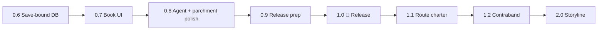

# Routier — Roadmap

> **Tagline:** Routier adds a trading layer to SailWind — market intel, agent
> contracts, and a real economic pulse to the archipelago.

**Version strategy:** ship incremental **0.6–0.9** builds while working toward a
polished **1.0** release. **1.1** adds the route charter; **1.2** adds contraband
runs; **2.0** is the full agent storyline (Discord poll: players want narrative
progression).

---

## Shipped (v0.1 – v0.5)

| Area | Done |
|------|------|
| **Market** | Hourly snapshots → SQLite; goods/ports catalog; currency & reputation |
| **Sim** | Python bulk-pricing model + route optimizer; C# port 1:1; web parity harness |
| **Routes** | Daily generation at hub ports (local + regional); per-save RNG seed |
| **Parchment** | Manifest-style pages (summary + per-port receipts); save-backed scroll item |
| **UI** | Route agent kiosk (placeholder cube); Canvas offer picker with detail + buy |
| **Web** | Dashboard: market lookup, charts, route planner, simulator |
| **Repo** | `src/` layout, GitHub, Thunderstore manifest, MIT license |

---

## Path to 1.0 — Release milestone

**1.0 goal:** a complete, shippable trading-contract experience — polished parchment,
real hub agent, save-safe data — then publish (Thunderstore + GitHub release).



### v0.6.x — Database per save slot

Each playthrough must own its market history; no cross-save snapshot bleed.

- [x] Resolve DB path from `SaveSlots.currentSlot` → `data/routier_slot{N}.db`
- [x] Re-open / swap DB on game load (`SaveLoadManager` post-load hook)
- [x] New game on a slot wipes Routier `modData` and deletes that slot's DB (fresh start)
- [x] No migration from legacy `routier.db`
- [x] Web dashboard: save-slot dropdown in header (`?slot=N`)
- [x] Parity script `check_route_parity.py`: `--slot N`

**Reference:** `SaveSlots.GetCurrentSavePath()` → `slot{N}.save`

### v0.7.x — Route offers as a book (mission-log style)

Replace the flat **Canvas overlay** with a **3D book UI** like the in-game mission log.

- [ ] Reuse patterns from `MissionListUI` (`book`), `MissionDetailsUI`,
  `GPButtonListedMission`
- [ ] Left page: today's offers (tier, kind, price, profit) — up to 6 rows
- [ ] Right page: route detail + buy
- [ ] Modal flow from agent (`MouseLook`, `Refs.SetPlayerControl`)
- [ ] VR: anchor on `PortDude.missionTable` when applicable
- [ ] Retire Canvas UI once book UI is stable

### v0.8.x — Real agent & parchment polish

**Agent** — replace the cube; **parchment** — final manifest quality for 1.0.

**Agent (GRC)**

- [x] Stall `market_stall (8)` + NPC + livre cliquable au quai GRC
- [x] Placement via scène île (build index 1) + ancre anti floating-origin
- [ ] Autres hubs (Dragon Cliffs, Fort Aestrin…) — poses à calibrer
- [ ] Remove `PrimitiveType.Cube` fallback des hubs non-GRC
- [ ] `lookText` / petit dialogue agent
- [ ] v0.7 book UI (remplace Canvas) depuis le livre du comptoir

**Bugs GRC — suivi**

- [ ] **Kiosk trop bas / dans le sol** après partir et revenir à GRC. OK au load
  save près du quai. **En observation** — noter load / départ / retour / FO
  avant de corriger. `HubKioskInstaller.TryInstallGrc`.
- [x] **Bake kiosk axes / pivot** — yaw source stall + `NormalizePivotToFeet` (root =
  bottom-center des meshes, plus de −1 X fantôme). Offsets livre/NPC **provisoires**
  — re-capturer avec SailwindHack.
- [x] **Parchemin à l’achat** spawn au-dessus du livre / comptoir kiosk
  (`RouteOffersUI.TryGetParchmentSpawn`).
- [x] **UI offres** : prix à gauche sans currency (currency reste sous le titre).

**Feature — accès îles par rep**

- [x] Al’Ankh : Oasis + Mirage Mountain ≥ 3, Saffron Island ≥ 5
  (`RouteIslandAccess` + filtre `RouteGenerator.BuildPool`).
- [ ] Autres archipels (Emerald / Aestrin / Lagoon) : TBD.

**Parchment (1.0 quality bar)**

- [ ] Layout pass: no overlap, consistent manifest typography (ongoing)
- [ ] Authenticity seal / stamp (company, issuing port, game day)
- [ ] In-game QA on several hub routes (multi-region, long names, empty legs)

### v0.9.x — Release prep

- [ ] Playtest full loop: 8am generation → agent → book → buy → read parchment → save/load
- [ ] Thunderstore package (icon, README, changelog, version bump)
- [ ] GitHub release + tagged build (`build.ps1`)
- [ ] Config defaults reviewed; breaking changes documented
- [ ] Optional: historical bulletin deferred post-1.0

### v1.0 — 🚢 Release

**Ship when all of the above are done.**

- [ ] Tag `v1.0.0`, publish Thunderstore + GitHub release
- [ ] README / manifest reflect 1.0 feature set
- [ ] Known limitations listed (no charter, contraband, or storyline yet)

**1.0 delivers:** daily route guides at hub ports, save-bound market DB, book-style
offer browser, real agent interactable, polished manifest parchment.

### Routes — déblocage par niveau de réputation

Les offres daily (et l'agent) doivent suivre la réputation **régionale** du hub
(`PlayerReputation.GetRepLevel`) — progression alignée storyline / vanilla.

| Rep level | Accès routes | Hops (local) | Capital max (budget route) | Poids max | Volume max |
|-----------|--------------|--------------|----------------------------|-----------|------------|
| **0** | **Aucun** — pas d'offres, agent indisponible ou message « revenez quand la région vous fait confiance » | — | — | — | — |
| **1** | Local seulement | **3** (fixe) | **500** | **250 lb** | **10 ft³** |
| **2** | Local | **3–4** | **1 000** | **500 lb** | **25 ft³** |
| **3** | Local | **3–5** | **5 000** | **1 000 lb** | **40 ft³** |
| **4** | Local **+ régional** | **3–5** | **15 000** | **4 000 lb** | **120 ft³** |
| **5+** | Local + régional | 3–5 | **Max actuel** (config `BudgetMax`, typ. 30 000) | **Max actuel** (pas de plafond gen.) | **Max actuel** (pas de plafond gen.) |

Capital = budget initial tiré au sort pour planifier la route (`BudgetMin`–`BudgetMax` dans
`RouteGenerator` ; aujourd'hui 2 000–30 000 global). Poids / volume = contraintes
passées à l'optimizer (`max_weight` / `max_volume` — déjà dans `sim/route_optimizer.py`
et le planner web ; **pas encore** dans le générateur C# in-game).

**Implémentation**

- [x] `RouteGenerator.GenerateForHub` : sauter génération si `repLevel < 1`
- [x] `HopsMin` / `HopsMax` dérivés du rep level (`RouteTierTable.cs`)
- [x] `BudgetMax` plafonné par palier rep ; niveau 5+ = config BepInEx
- [x] `SequentialRoutePlan(..., maxWeight, maxVolume)` — contraintes cargo par palier
- [x] Rejeter routes dont le plan dépasse poids / volume du palier
- [x] Niveau &lt; 4 : ne pas générer les offres `regional`
- [x] UI agent : message si rep level 0
- [ ] UI agent : expliquer le prochain palier (hops, capital, cargo, régional)
- [ ] Parité sim / web si le planner doit refléter les mêmes gates
- [x] **Accès îles par rep level** (Al’Ankh) — Oasis + Mirage Mountain ≥ 3,
  Saffron Island ≥ 5 ; autres archipels TBD (`RouteIslandAccess`).

**Référence actuelle :** `RouteGenerator.cs` utilise déjà `repLevel` pour le % agent
(cut) mais génère local + regional à tous les niveaux avec budget global unique — à restreindre.

**Comportement (v0.7.0 — tableau de manifests)**

- **8h** : **5 local + 2 regional** slots par hub (`LocalCount` / `RegionalCount`).
- Chaque slot = tier aléatoire (local 1–5, regional 4–5), contraintes via `RouteTierTable`.
- Un slot peut rester **vide** si aucun plan valide (marché réaliste).
- **UI** : tout le tableau visible ; manifests verrouillés **grisés** + **Rep L{n} required** en rouge.
- **Achat** : `playerRep >= RequiredPlayerRep(offer)` ; montée de rep dans la journée débloque sans regen.
- **Équilibre** : `src/Routes/RouteTierTable.cs` (`FixedTiers`, `Tier5*` constants).

**Implémentation v2**

- [x] Générer 5+2 ; tier aléatoire par slot
- [x] Regional slots → tier 4–5
- [x] UI grisé + rep requis en rouge
- [x] Tier 5 : 50 000 / 10 000 lb / 500 ft³
- [ ] Parité sim / web
- [ ] UI : expliquer prochain palier rep (hors liste grisée)

**Design doc :** `docs/STORYLINE.md` (progression archipel / mandats).

---

## v1.1 — Route charter

**Goal:** buy exclusivity on a **single good** along a **two-island corridor** — AI
traders abstain from that good on those ports for N days.

- [ ] New service tier on top of the route manifest (premium purchase)
- [ ] Harmony patch on `TraderBoat` — skip the chartered good at corridor ports
- [ ] Save-backed expiration (`GameState.day`, "valid until day N" on parchment)
- [ ] Honest limits: `EconCycle`, player trades, and missions still apply (no absolute
  monopoly)
- [ ] Sim / web tool to preview charter value before buying

**Scope:** 1 good, 2 islands (A ↔ B or A → B). Multi-hop charters = later.

---

## v1.2 — Contraband

**Goal:** a **hidden agent** sells high-profit **illegal goods** — separate from the
official route agent at hubs. Selling carries a real risk of being caught by port
authorities.

### Concept

- **Hidden contact** — not at the mission desk; discoverable location (tavern back
  room, night-only dock, reputation-gated whisper, etc.)
- **Contraband manifest** — parchment listing buy port, sell port, good, qty, expected
  profit (higher margin than legal routes)
- **Sell-side risk** — chance (or deterministic checks) of seizure / fine / reputation
  hit when unloading illegal cargo at port
- **No charter overlap** — contraband goods are outside the 1.1 TraderBoat abstention
  model (different ruleset)

### Implementation sketch

- [ ] Catalog of contraband goods per archipelago (subset of `goods_catalog` or mod-tagged
  illegal list)
- [ ] Hidden agent interactable + separate offer UI (book page style or compact list)
- [ ] Route planner variant: legal sim + contraband premium multiplier
- [ ] **Catch on sell** — hook port entry / market sell (`QuestItemDetector` precedent:
  seizure, bribe, reputation penalty)
- [ ] Config: catch probability, fine tiers, reputation damage, time-of-day modifiers
- [ ] Parchment disclaimer: *"Unregistered cargo — authorities may intervene"*
- [ ] Save-backed: active contraband run, heat/cooldown per port (optional)

### Design questions (TBD)

- [ ] Random catch % vs. fixed inspection windows (like vanilla `activeFrom` / `activeUntil`)?
- [ ] Does getting caught affect the **official** route agent's trust (storyline hook for 2.0)?
- [ ] One contraband offer per day vs. player-initiated contact?

**Reference:** `QuestItemDetector` — illegal cargo seizure, bribe, reputation reset at port.

---

## v2.0 — Agent storyline

**Goal:** the route agent becomes a **narrative spine** — unique missions over time
that evolve the player across archipelagos. Aligns with Discord poll (storyline > pure
mechanics).

**Design doc :** `docs/STORYLINE.md` (includes engagement loop: Stakes → Big Question →
Head fake → Re-hook; ref [YouTube](https://www.youtube.com/watch?v=KyC8r-zitVE))

### Main arc (proposed) — Treasure, Lucky & pirate mentor

**Backstory:** two captains hunt the **same treasure** for years, working **against** each
other after an old feud (the pirate wasn't kind to **Captain Lucky**).

**Surface:** the pirate becomes the player's **mentor** — seems helpful; quests sometimes
morally grey.

**Escalation:** rumour that Lucky **found the treasure** → mentor gives "innocent" quests
actually woven to **steal** it → finds Lucky, no chest → sinks Lucky's ship.

**Twist:** the gold **is the boat** — all metal fittings are **gold, painted over**. The
pirate didn't know.

| Beat | Working title | Notes |
|------|---------------|-------|
| P-1 | The mentor | Meet pirate; first useful favour |
| P-2 | Not very nice | Grey ask (e.g. **1.2** contraband) |
| P-3 | Favours pile up | Soft theft / "I've been robbed" style |
| P-4 | The rumour | Lucky found the treasure |
| P-5 | Innocent quests | Camouflaged theft setup |
| P-6 | Lucky found | No chest visible |
| P-7 | The sinking | Pirate sinks Lucky's boat (no FPS combat) |
| P-8 | Paint flakes off | **Reveal: boat metals = painted gold** → end |

**Teaser (I-fin):** « Really… *Lucky*… after all that. »

**Archived ideas:** agent-as-villain, rum/shipyard trap, testify-to-repair — superseded.

### Pillars

1. **Recurring agent** — same company / character at hubs (or one archipelago lead per
   region), not a faceless kiosk.
2. **Unique missions** — scripted beats tied to reputation, wealth, or ports visited;
   not just rerolled daily routes.
3. **Progression over time** — unlock tiers, new corridors, harder contracts, story
   branches as `GameState.day` and regions advance.
4. **Archipelago arc** — missions that pull the player between island groups (local →
   regional → cross-archipelago stakes).
5. **No combat** — mentor betrayal, grey quests, sinking, painted-gold twist (Sailwind tone).

### Early design questions (TBD)

- [ ] One global storyline vs. per-archipelago threads?
- [ ] Mission data: JSON mod content vs. DB-driven vs. hybrid?
- [ ] Failure / expiry: do story missions penalize like vanilla cargo missions?
- [ ] Integration with 1.1 charter (story rewards = charter discounts?)
- [ ] Soft-dep on Random Encounter if used for chase/sinking beat?
- [ ] Pirate mentor name?
- [ ] How does the pirate sink Lucky's boat without combat?
- [ ] Salvage painted-gold fittings after P-7 — playable?
- [ ] Aftermath vs mentor (confront / flee / share gold with Lucky)?

### Out of scope for 2.0 v1

- Full voice acting, cinematics, new 3D character models
- Replacing vanilla mission system entirely
- Combat / boarding fights with the pirate

---

## Architecture

```
                    ┌─────────────────────────────────────┐
  v1.0              │  Agent → book UI → buy → parchment  │
                    └─────────────────┬───────────────────┘
                                      │
                              routier_slot{N}.db
                                      │
  v1.1              ┌─────────────────▼───────────────────┐
                    │  + Route charter (TraderBoat patch) │
                    └─────────────────┬───────────────────┘
                                      │
  v1.2              ┌─────────────────▼───────────────────┐
                    │  + Contraband agent & sell risk     │
                    └─────────────────┬───────────────────┘
                                      │
  v2.0              ┌─────────────────▼───────────────────┐
                    │  + Story missions & archipelago arc │
                    └─────────────────────────────────────┘
```

---

## Backlog / references

### Game systems (decompiled v0.38)

| System | Role |
|--------|------|
| `MissionListUI` / `book` | Book-style offer browser (v0.7 → 1.0) |
| `MissionLog` | Journal / log rows |
| `MissionDetailsUI` | Detail page layout |
| `TradeReceiptsUI` | Table columns on panels |
| `ShipItemScroll` | Physical parchment item |
| `SaveSlots` | Per-save DB (v0.6) |
| `QuestDude` / `PortDude` | Agent interaction (v0.8 → 1.0) |
| `TraderBoat` | Charter abstention target (v1.1) |
| `QuestItemDetector` | Illegal cargo seizure / bribe / rep hit (v1.2 contraband) |

### Sim & data hygiene

- [x] `market_globals`, `goods_catalog`, `ports_catalog`
- [x] Bulk sim — beer @ Gold Rock (`sim/fixtures/gold_rock_beer.json`)
- [x] Web Simulator + Route tabs
- [ ] Calibrate `supply` from first observed price (web API, partial)
- [ ] Long-route playtest (e.g. Oasis → Academy → Gold Rock City)

### Post-1.0 ideas (not scheduled)

- Historical price bulletin (1 good, N days, from snapshots)
- Simple price chart as parchment texture
- Per-good specialist agents
- Multi-hop route charter
